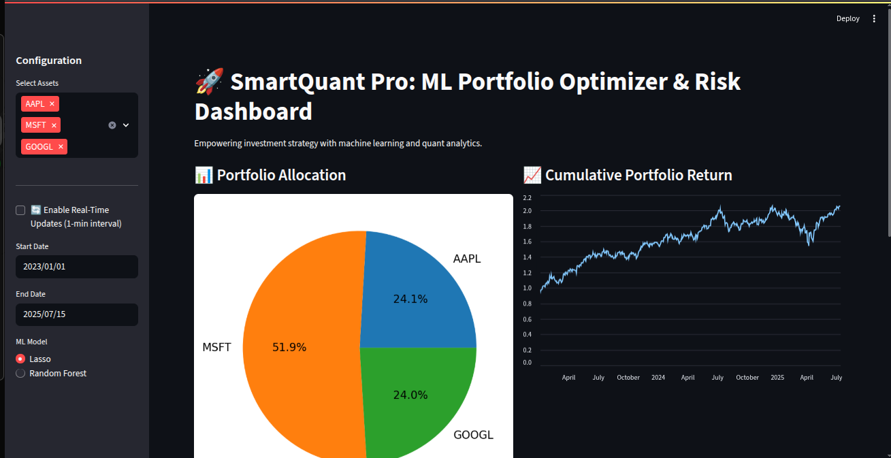
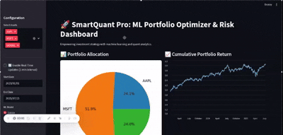
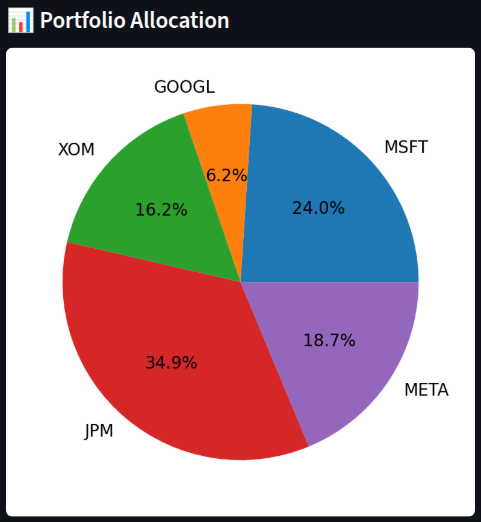

#  SmartQuant Pro – Real-Time ML Portfolio Optimizer & Risk Dashboard

SmartQuant Pro is a **real-time, machine learning-powered portfolio optimization dashboard** designed to help investors allocate capital across assets intelligently while monitoring key risk metrics.

Built with 🐍 **Python**, 📈 **Streamlit**, and 🔬 **machine learning**, this project is a complete quant toolkit — inspired by how professionals at firms like Goldman Sachs approach systematic trading and portfolio construction.



---

## 📌 Features

✅ Forecasts asset returns using:
- 🔷 Lasso Regression
- 🔶 Random Forest Regressor

✅ Optimizes portfolio using:
- 🧮 Modern Portfolio Theory (Minimize Volatility or Maximize Sharpe)

✅ Visualizes:
- 📊 Portfolio Weights (Pie & Table)
- 📈 Cumulative Returns
- 📉 Rolling Volatility
- ⚠️ Risk Metrics: VaR, CVaR, Max Drawdown

✅ Real-time capabilities:
- 🔁 Live stock price fetching via `yfinance`
- 🔄 Refresh portfolio allocation and risk in real-time

✅ Interactive controls:
- Choose tickers, ML model, date range, risk level
- All updates reflected instantly in dashboard

---

## 🎥 Demo




---


## 🛠 Tech Stack

| Component        | Library/Tool       |
|------------------|--------------------|
| Frontend         | `Streamlit`        |
| Data             | `yfinance`         |
| ML Models        | `scikit-learn`     |
| Optimization     | `cvxpy`            |
| Visualization    | `matplotlib`, `seaborn` |
| Risk Analytics   | Custom (VaR, CVaR, Drawdown) |

---

## 🚀 Getting Started
```bash
git clone https://github.com/your-username/SmartQuantPro.git
cd SmartQuantPro
pip install -r requirements.txt
streamlit run smartquant_app.py
